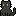
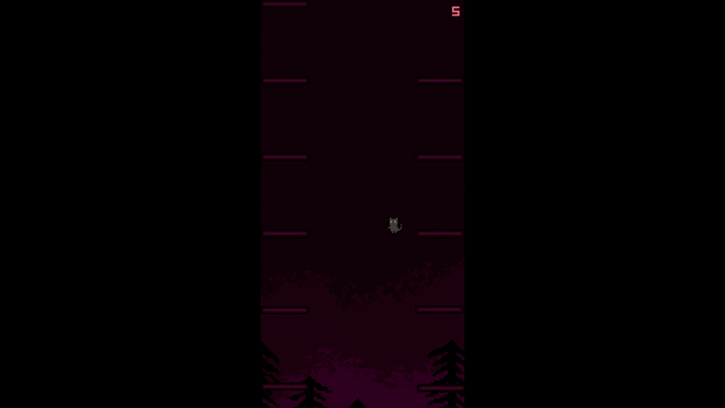

# LeapInTheShadow
A casual climbing game where you carefully move upward, tile by tile. Avoid mistakes, and see how high you can go.

## game controls
Left arrow - jump left  
Right arrow - jump right
## Building
1. clone repository
```bash
git clone https://github.com/maniulka209/LeapInTheShadow
```
2. Open the project in **Visual Studio**.
3. Select **Release** configuration.
4. Go to **Build > Publish Selection**.
5. Choose:
   - **Target:** Folder
   - **Specific target:** Folder
6. Click **Finish** then you can close this window.
7. Click **Publish**
8. The compiled game will appear in the `publish` folder as `LeapInTheShadow.exe` along with all required files.
## Inspiration
LeapInTheShadow was inspired by [this game](https://gx.games/pl/games/ebyzbm/run-bun-bun-run/)
#


